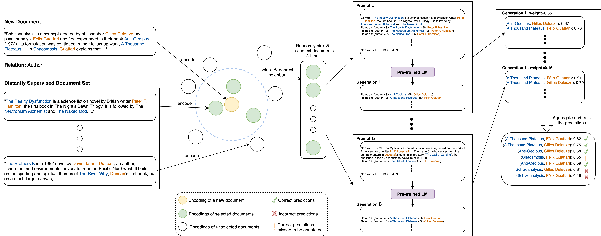

# REPLM: Document-Level In-Context Few-Shot Relation Extraction via Pre-Trained Language Models

We used Python 3.8.5 in our experiments. 

You can install the requirement libraries via `pip install -r requirements.txt` into your new virtual Python environment.

## Data pre-processing

First step is to download the DocRED dataset, following the instructions from the [original repository](https://github.com/thunlp/DocRED/tree/master). As a result, you should have a new folder `./DocRED`.

Then you can run the pre-processing pipeline [DocRED_preprocess/main.sh](DocRED_preprocess/main.sh).

## Running our REPLM framework

Run the inference for L different sets of in-context few-shot examples (by changing <seed_no>):

`python extract_relations.py --relation <rel_id> --seed <seed_no> --experiments_main_folder experiment_<rel_id> --experiment_folder seed<seed_no>`

After running for different seeds, aggregate their results as follows: 

`python aggregate_extractions.py --temperature <temperature> --threshold <threshold> --experiments_main_folder experiment_<rel_id>`

This should yield `experiment_<rel_id>/aggretaged_predictions.csv`

## Evaluation via external knowledge base

Extracted relations from DocRED can be further evaluated/compared from [WikiData](https://www.wikidata.org/).

To achieve this, first you need to clone [simple-wikidata-db](https://github.com/neelguha/simple-wikidata-db) and follow the steps there to have a local copy of WikiData. 
(**Of note:** One can ideally use the [online query service](https://query.wikidata.org) of WikiData instead of a local copy, however, it is too slow to run queries for thousands of extracted relations.)

For convenience we repeat the important steps here: 

- Open the `./simple-wikidata-db` directory, which you recently cloned.

- Fetch the most recent dump of WikiData

`wget https://dumps.wikimedia.org/wikidatawiki/entities/latest-all.json.gz`

- Run the process (Note: it's a CPU-heavy process)

`python simple_wikidata_db/preprocess_dump.py --input_file latest-all.json.gz --out_dir PROCESSED_DATA/ --num_lines_in_dump -1 --processes 200 --batch_size 250000`

- The local copy of WikiData should be ready at `./simple-wikidata-db/PROCESSED_DATA`

The final step is to compare the extracted relations against WikiData entries

`python pred_to_wikidata.py --pred_folder experiment_<rel_id> --pred_file aggregated_predictions.csv --rel_id <rel_id> -p_alias "simple-wikidata-db/PROCESSED_DATA/aliases" -p_rels "simple-wikidata-db/PROCESSED_DATA/entity_rels"` 

This should yield `experiment_<rel_id>/preds_in_wikidata.csv`, which lists the extracted relations from the documents that also appear in the knowledge base WikiData.